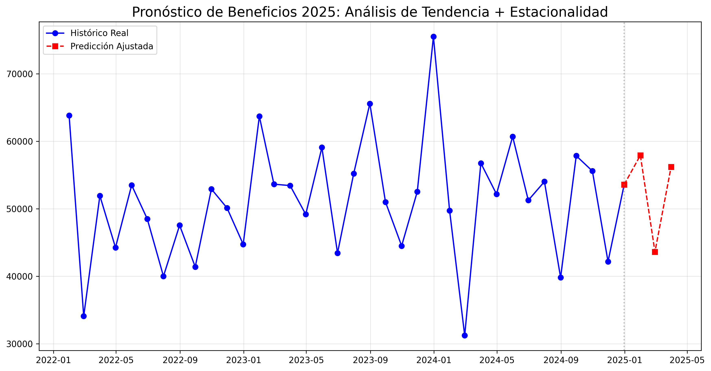
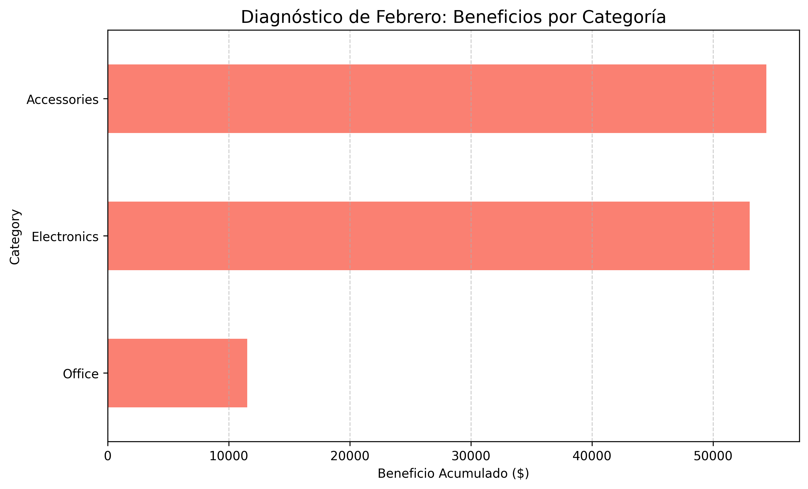
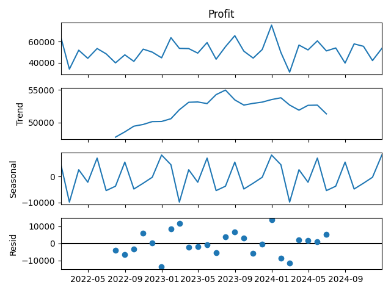

# 📈 E-commerce Profit Forecasting & Diagnostics

## 📝 Resumen del Proyecto
Este proyecto analiza 3 años de datos de ventas globales de un e-commerce (2022-2024) para predecir el rendimiento financiero del primer trimestre de 2025. El objetivo fue identificar patrones estacionales y diagnosticar las causas de las fluctuaciones en el beneficio neto.

Utilicé un modelo híbrido que combina **Regresión Lineal** para la tendencia a largo plazo con **Ajustes Estacionales** basados en la descomposición de series temporales.

## 📊 Key Insights (Hallazgos Clave)
* **Tendencia General:** El negocio muestra un crecimiento sostenido, pero con una ligera desaceleración en el impulso de beneficios al cierre de 2024.
* **Alerta de Febrero:** El modelo predice una caída recurrente en febrero con un beneficio proyectado de **$43,028**, un valor significativamente menor al promedio mensual de $51k.
* **Causa Raíz:** Mediante un análisis de diagnóstico, se identificó que la categoría **Office Supplies** rinde un **78% menos** que el resto de las categorías durante febrero, siendo el principal detractor del beneficio total.

## 💡 Recomendaciones Estratégicas
Basado en la evidencia de los datos, se proponen las siguientes acciones para mitigar el impacto en febrero:

1. **Campaña de Liquidación Proactiva:** Lanzar promociones de "Back to Office" a finales de enero para movilizar el inventario de suministros de oficina antes de la caída estrepitosa de la demanda en febrero.
2. **Reasignación de Presupuesto de Marketing:** Durante febrero, reducir la inversión publicitaria en *Office Supplies* y potenciar las categorías de *Accessories* y *Electronics*, que demuestran resiliencia con beneficios superiores a los $53k.
3. **Optimización de Inventario:** Evaluar si el bajo rendimiento en oficina se debe a costos logísticos elevados o falta de rotación, ajustando el stock para mejorar el flujo de caja en el primer trimestre.

## 🛠️ Tecnologías Utilizadas
* **Python** (Pandas, Numpy)
* **Análisis Estadístico:** Statsmodels (Seasonal Decompose)
* **Machine Learning:** Scikit-Learn (Linear Regression)
* **Visualización:** Matplotlib

## 📈 Visualizaciones

### 1. Pronóstico de Beneficios 2025

*Comparación entre el histórico real y la predicción ajustada por estacionalidad.*

### 2. Diagnóstico de Categorías (Febrero)

*Identificación de las categorías con menor desempeño durante el mes crítico.*

### 3. Descomposición de la Serie Temporal

*Análisis de la tendencia pura, la estacionalidad y el residuo de los datos.*
